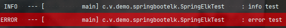
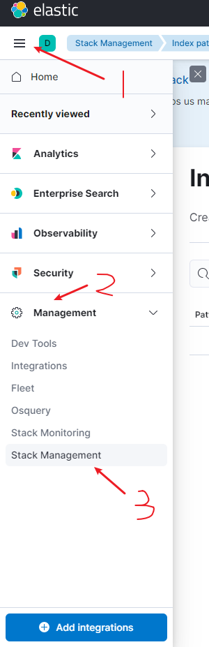
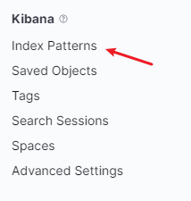
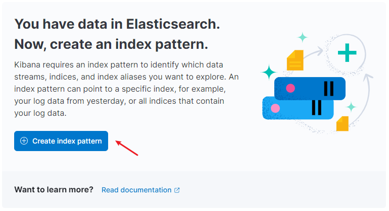
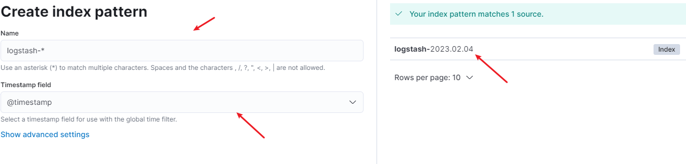
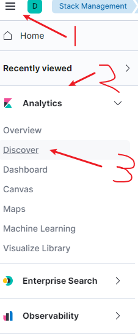
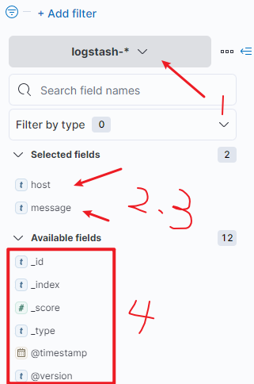
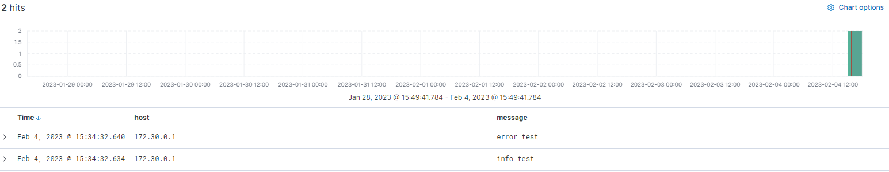

# spring-boot-elk

單純使用 logstash pom 不需要引入 elasticsearch

使用 logback.xml 方式發送到 logstash 或是 log4j2 方式

啟動 docker-compose，可能會遇到下載問題，可以手動先 docker pull   
`docker-compose up --build -d`

查看 elastic ui  
`loaclhost:5601`

打開網址後，執行 test 印出 log  


### 接著打開



### 找到 kibana



### 建立 index




在執行 test 跑資料後，才有辦法建立 index  
index 名稱根據 logstash.conf 設置

```
input {
    tcp {
        mode => "server"
        port => 5000
        codec => json_lines
    }
}

output {
    elasticsearch {
        hosts => "elasticsearch:9200"
        index => "logstash-%{+YYYY.MM.dd}"
    }
}
```

### 接著找到 Discover 並選取剛剛的 index，過濾條件即可



